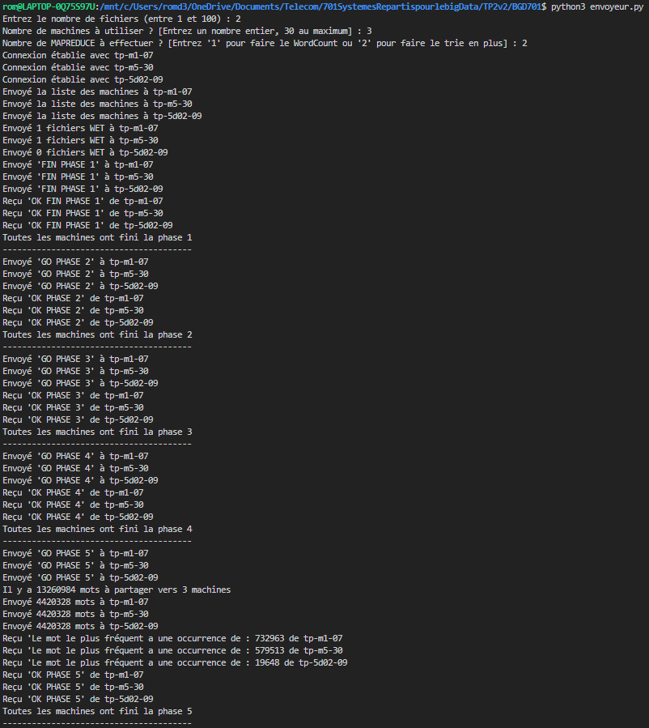
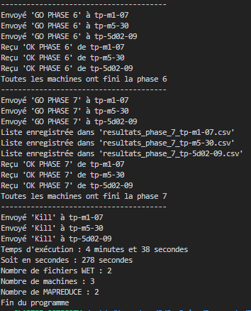
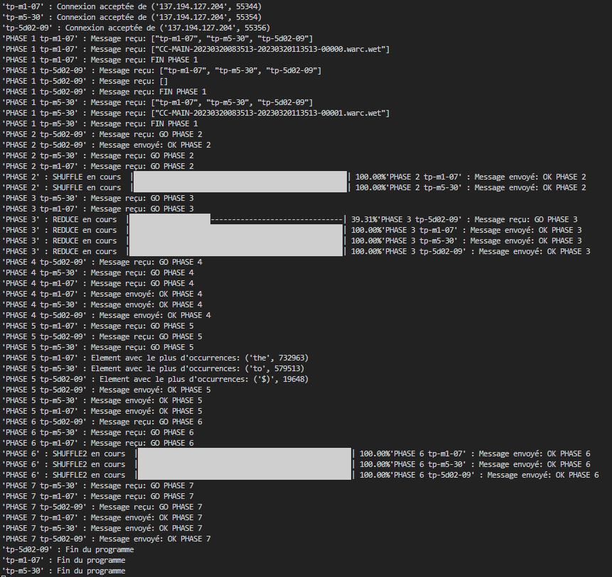

# Système Réparti en TCP

Ce projet implémente un **système réparti** basé sur la communication **TCP**. Il permet à plusieurs clients de communiquer avec un serveur central via des connexions TCP, dans le but d'échanger des messages de manière fiable.

## Table des matières
1. [Description du projet](#description-du-projet)
2. [Architecture du système](#architecture-du-système)
3. [Prérequis](#prérequis)
4. [Installation](#installation)
5. [Utilisation](#utilisation)
6. [Résultats obtenus](#Résultats-obtenus)

---

## Description du projet

Ce projet a pour but de faire un MAPREDUCE, c'est à dire de compter le nombre d'apparition de mots présents dans des fichiers .wet. 

### Fonctionnalités principales
- Connexion sécurisée entre le client et le serveur via TCP.
- Envoi de messages entre le client et le serveur avec gestion de la taille des messages pour éviter les problèmes de fragmentation.
- Utilisation de **sockets** pour la communication réseau et **struct** pour la gestion de la taille des messages.
- Traitement fiable des données avec la garantie d'une réception complète du message.

## Architecture du système

- **Serveur** :
  - Le serveur écoute sur un port spécifique et accepte les connexions entrantes des clients.
  - Le serveur reçoit un message, le traite, puis envoie une réponse au client.
  
- **Client** :
  - Les clients se connectent au serveur via TCP.
  - Un client peut envoyer plusieurs messages au serveur et recevoir des réponses.

## Prérequis

Avant de commencer, assurez-vous d'avoir une réseau contenant plusieurs machines 


## Installation

Clonez le repository sur votre machine locale :

   ```bash
   git clone https://github.com/ton-utilisateur/nom-du-repository.git
   ```

## Utilisation 

Modifiez le fichier :
- machines.txt avec les machines de votre réseau pour lesquels vous avez créé une connexion SSH par clé
- fichiersWET.txt avec le nom des fichiers que vous voulez annalyser

Depuis un autre terminal, lancez une communication SSH et mettez les workers sur écoute via la commande bash :
    ```bash
    ./deploy_new.sh
    ```

Ouvrez un autre terminal et lancez l'envoyeur depuis la machine maitre :
    ```bash
    python3 envoyeur.py
    ```
L'envoyeur va répartir les fichiers entre les diverses machines

## Résultats obtenus 

<p align="center">
  
  
  
</p>